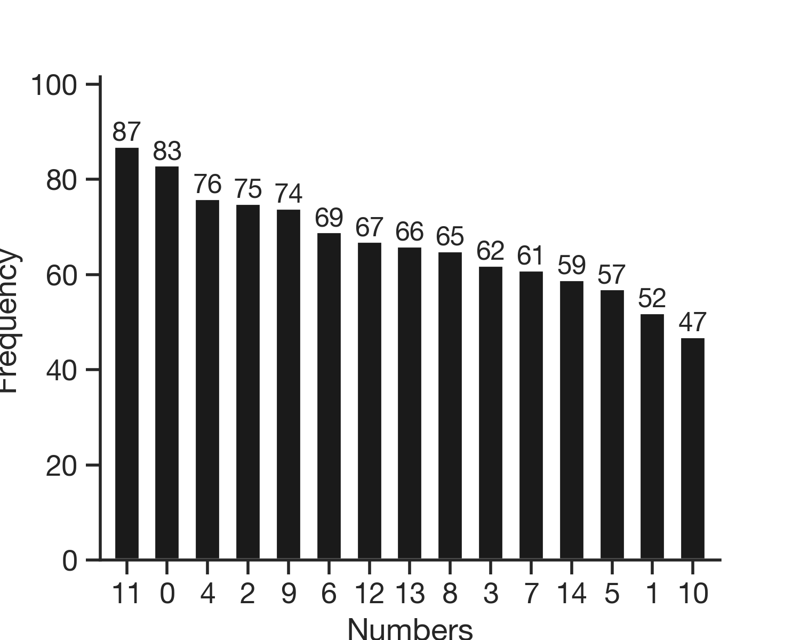

<h1 align="center">python-dohlee</h1>
<p align="center">My personal python library.</p>
<p align="center">
  <a href="https://readthedocs.org/projects/python-dohlee"></a>
  <a href="https://pypi.python.org/pypi/dohlee"></a>
  <a href="https://travis-ci.org/dohlee/python-dohlee"></a>
  <a href="https://coveralls.io/r/dohlee/python-dohlee"></a>
</p>

<h2 align="center">Installation</h2>

```
pip install dohlee
```

<h2 align="center">Examples</h2>

### dohlee.plot

Plotting library. Provides simple ways to produce publication-ready plots.

***dohlee.plot.mutation_signature***
```python
import dohlee.plot as plot; plot.set_style()  # Sets plot styles.
ax = plot.get_axis(figsize=(20.4, 3.4))
plot.mutation_signature(data, ax=ax)
```


***dohlee.plot.boxplot***
```python
ax = plot.get_axis(preset='wide', transpose=True)
plot.boxplot(data=iris, x='species', y='sepal_length', ax=ax)
```

<p align='center'></p>

***dohlee.plot.histogram***
```python
ax = plot.get_axis(preset='wide')
plot.histogram(iris.sepal_length, bins=22, xlabel='Sepal Length', ylabel='Frequency', ax=ax)
```

<p align='center'></p>

***dohlee.plot.frequency***
```python
ax = plot.get_axis(preset='wide')
plot.frequency(data, ax=ax, xlabel='Your numbers', ylabel='Frequency')
```

<p align='center'></p>
