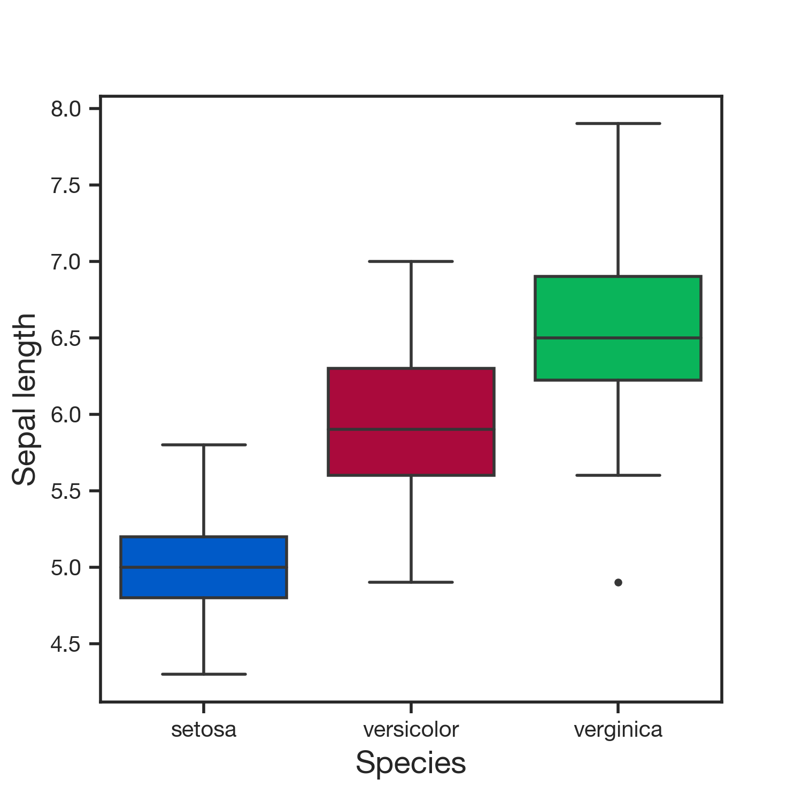

<h1 align="center">python-dohlee</h1>
<p align="center">My personal python library.</p>
<p align="center">
  <a href="https://readthedocs.org/projects/python-dohlee"></a>
  <a href="https://pypi.python.org/pypi/dohlee"></a>
  <a href="https://travis-ci.org/dohlee/python-dohlee"></a>
  <a href="https://coveralls.io/r/dohlee/python-dohlee"></a>
</p>

<h2 align="center">Installation</h2>

```
pip install dohlee
```

<h2 align="center">Examples</h2>

### dohlee.plot

Plotting library. Provides simple ways to produce publication-ready plots.

***dohlee.plot.mutation_signature***
```python
import dohlee.plot as plot; plot.set_style()  # Sets plot styles.
ax = plot.get_axis(figsize=(20.4, 3.4))
plot.mutation_signature(data, ax=ax)
```


***dohlee.plot.boxplot***
```python
ax = plot.get_axis(preset='wide', transpose=True)
plot.boxplot(data=iris, x='species', y='sepal_length', ax=ax)
```

<p align='center'></p>

***dohlee.plot.histogram***
```python
ax = plot.get_axis(preset='wide')
plot.histogram(iris.sepal_length, bins=22, xlabel='Sepal Length', ylabel='Frequency', ax=ax)
```

<p align='center'></p>

***dohlee.plot.frequency***
```python
ax = plot.get_axis(preset='wide')
plot.frequency(data, ax=ax, xlabel='Your numbers', ylabel='Frequency')
```

<p align='center'></p>

***dohlee.plot.tsne***
```python
ax = plot.get_axis(preset='wide')
plot.tsne(
    iris[['sepal_length', 'sepal_width', 'petal_length', 'petal_width']],
    ax=ax,
    s=5,
    labels=iris['species']
)
```
<p align='center'></p>

***dohlee.plot.stacked_bar_chart***
```python
# Generate sample data.
n_samples = 100
sample_dict = {'Sample': ['S%d' % i for i in range(1, n_samples + 1)]}
value_dict = {c: np.random.randint(0, 100, size=n_samples) for c in ['Missense', 'Nonsense', 'Silent']}
test_data = pd.DataFrame({**sample_dict, **value_dict})
# Plot stacked bar chart.
plot.stacked_bar_chart(
    data=test_data,          
    x='Sample',
    y=['Missense', 'Nonsense', 'Silent'],
    ax=plot.get_axis(figsize=(14.4, 3.4)),
    xticklabels=False,
    sort=True,
    ylabel='Number of mutations',
    xlabel='Sample',
    legend_size='xx-large')
```
<p align='center'></p>

***dohlee.plot.linear_regression***
```python
ax = plot.get_axis(preset='wide')

x = np.linspace(0, 1, 100)
y = 2 * x + 3 + np.random.normal(0, 0.3, len(x))

plot.linear_regression(x, y, ax=ax)
```
<h2 align='center'></h2>

<h2 align='center'>Development</h2>

Since this package is updated as needed when I'm doing my research, the development process fits well with TDD cycle.
- When you feel a need to write frequently-used research workflow as a function, write rough tests so that you can be sure that the function you've implemented just meets your need. Write the name of test function as verbose as possible!
-  Run test with following commands. By default, nosetests ignores runnable files while finding test scripts. *--exe* option revokes it.
```shell
nosetests --exe --with-coverage --cover-package=dohlee
```
OR
```shell
tox -e py35,py36
```
- When sufficient progress have been made, test if the package can be published.
```shell
tox
```
- If all tests are passed, distribute the package via PyPI.
```shell
python setup.py sdist
twine upload dist/dohlee-x.x.x.tar.gz
```
